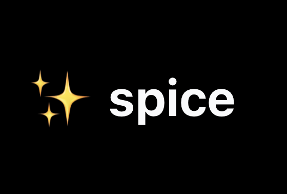

  <a href="https://spice.cloud">
    <h1 align="center">✨ spice-agent</h1>
  </a>

  

  

 

  
  

    
  
  

## Getting Started

Get an invite code from a friend of join the waitlist at <a aria-label="spice.cloud" href="https://spice.cloud/signup">https://spice.cloud/signup</a> to get started!

## Documentation

Visit [https://spice.cloud/docs](https://spice.cloud/docs) to view the full documentation.

## Community

The Spice community can be found on [Discord](https://discord.gg/DAhNzUse), where you can ask questions, voice ideas, and share your AI prompts.

Our [Code of Conduct](https://github.com/spicecloud/agent/blob/main/CODE_OF_CONDUCT.md) applies to all Spice community channels.

<!-- ## Contributing

Please see our [contributing.md](/contributing.md). -->

### Good First Issues

We have a list of [good first issues](https://github.com/spicecloud/agent/labels/good%20first%20issue) that contain bugs that have a relatively limited scope. This is a great place to get started, gain experience, and get familiar with our contribution process.

## Authors

- Dylan Stein ([@d_j_stein](https://twitter.com/d_j_stein))
- Ankush Patel ([@ankushp98](https://twitter.com/ankushp98))

<!-- ## Security

If you believe you have found a security vulnerability in the Spice ecosystem, we encourage you to responsibly disclose this and not open a public issue. We will investigate all legitimate reports. Email `security@spice.cloud` to disclose any security vulnerabilities.

https://spice.cloud/security -->

## Credits

- README.md based on Vercel's Next.js [README.md](https://github.com/vercel/next.js/blob/main/packages/next/README.md)
